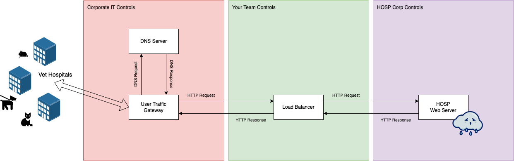
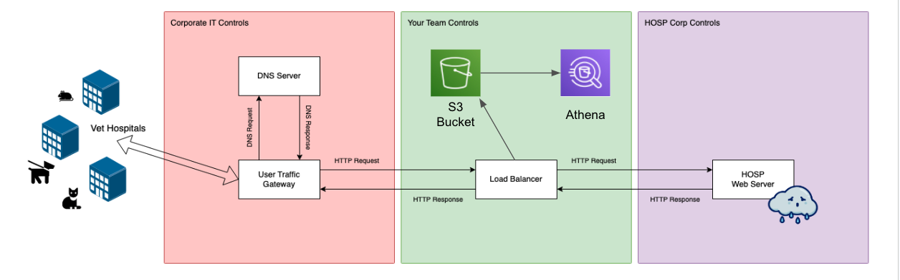
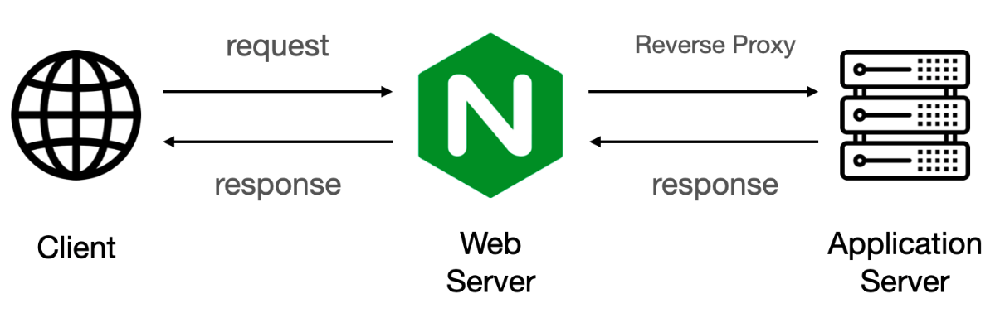
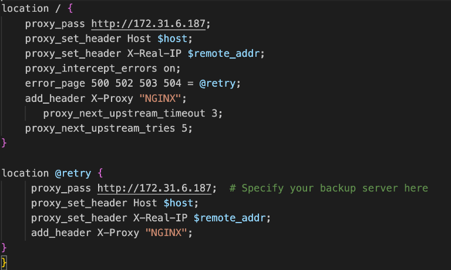
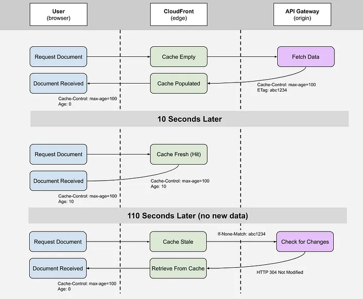
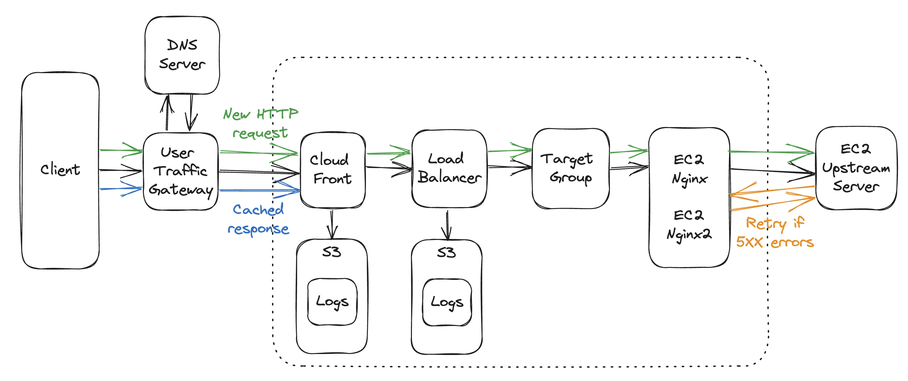
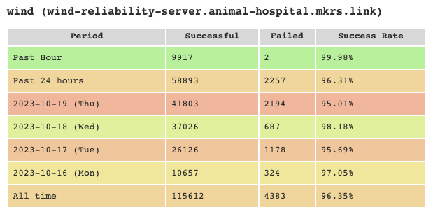
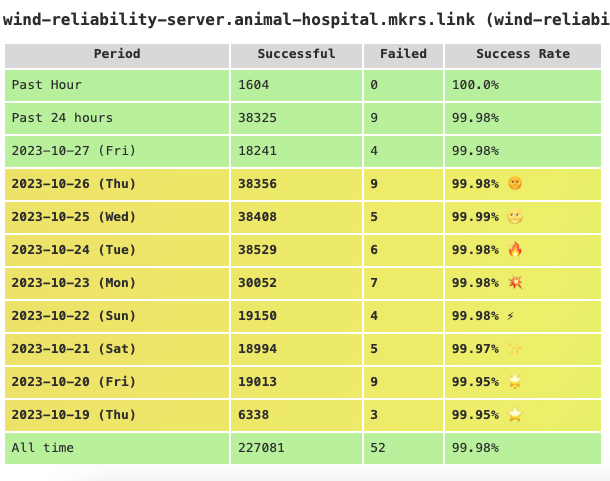

<h1 align="center">
 Reliability Project
</h1>

  This project is a Reliability Project, completed as part of Makers Academy Bootcamp during Week 7 & 8 of the Cloud/DevOps Engineering stream.

## 🎥 Demo Day oand Presentation

[Demo Day Video](https://youtu.be/XLbIx-UmkZY?si=G-QV16Xj--54PG45&t=2400) 
[Slides](https://docs.google.com/presentation/d/1amX-0ldebGgqnS9o0RDahwf0Znf59SYq06b_S-MdsrI/edit?usp=sharing)

## 🤝 Our Team
* [Andrew Shakespeare](https://github.com/shakey0)
* [Benedict Valuks](https://github.com/BValuks)
* [Carolina Nogueira](https://github.com/caronog)
* [Denise Chan](https://github.com/denisecodes)
* [Zubayda Hagi](https://github.com/Zhagi)

## 🏡 The scenario

We were tasked to work for a veterinary hospital client's HOSP system where we were asked to:
* Preserve the functionality of the system
* Increase the reliability of the system and ensure no security breaches
* Implement some improvements to the system

## ⛔️ Constraints and Access
* We only had access to the Load Balancer
* We could submit tickets to HOSP or Corporate IT

## 🎯 Our Reliability Target

* The system responds to 99% of user requests successfully
* Ensure no security breaches

## Getting Visibility 

* Set up an S3 bucket to get logs from the Load Balancer
* Use Athena on AWS to query the logs

## Findings

* Saw the we had a fair amount of 5XX status codes
* Varying response times from 2 to 20 seconds

## Improving the Reliability of the System

### 1. Retry Mechanism

Using a retry mechanism would allow for 5XX status codes to be go through the HOSP server up to a certain number of time, rather than just once.

This would increase the success rate of requests and improve the reliability of the system.

#### Set Up 
* Created an Nginx Web Server on an EC2 Instance
* Set up a Reverse Proxy on the Nginx server
    * Allowed failed requests to retry up to 5 times
    * 3 seconds interval between each retry

   

### 2. Caching

Using caching would allow us to store data closer to the user so users can access the data faster. 

This would significantly decrease the amount of requests going directly to the HOSP server as data can be retrieved from the cache instead of the API gateway for some requests, improving the reliability of the system.

#### Set Up 
* Create a CloudFront Distribution
* Set up the LoadBalancer as the origin (where traffic is coming from)
* Set up Time to Live (TTL) for 2 mins, allowing data to be stored for up to 2 mins in the cache before expiring and making a new requests to the HOSP server
 

The following diagram shows our infrastructure after setting up a two Nginx Reverse Proxy Servers and a CloudFront.

### Results

The HOSP's server success rate on the first 4 days 

The HOSP's server consistent success rate of 99.95% and above during the last half of the project 

## Mitigating Security Breaches

During the project, we faced security breaches where people with unauthorised access to the HOSP server were able to leave patient notes.

To tighten up the security of our infrastructure, we decided to complete one of the improvement tickets - Make the service available via HTTPS, given all traffic is HTTP.

