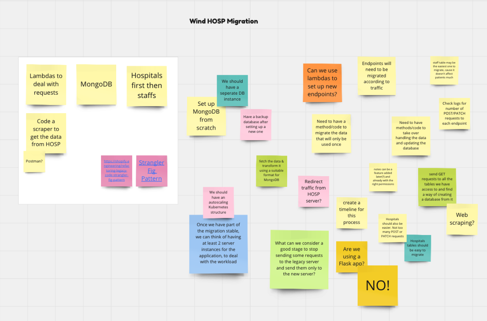

<h1 align="center">
 Reliability Project
</h1>

  This project is a Reliability Project, completed as part of Makers Academy Bootcamp during Week 7 & 8 of the Cloud/DevOps Engineering stream.

## 🎥 Demo Day and Presentation

[Demo Day Video](https://youtu.be/XLbIx-UmkZY?si=G-QV16Xj--54PG45&t=2400) 
[Slides](https://docs.google.com/presentation/d/1amX-0ldebGgqnS9o0RDahwf0Znf59SYq06b_S-MdsrI/edit?usp=sharing)

## 🤝 Our Team
* [Andrew Shakespeare](https://github.com/shakey0)
* [Benedict Valuks](https://github.com/BValuks)
* [Carolina Nogueira](https://github.com/caronog)
* [Denise Chan](https://github.com/denisecodes)
* [Zubayda Hagi](https://github.com/Zhagi)

## 🏡 The scenario

We were tasked to work for a veterinary hospital client's HOSP system where we were asked to:
* Preserve the functionality of the system
* Increase the reliability of the system and ensure no security breaches
* Implement some improvements to the system

## ⛔️ Constraints and Access
* We only had access to the Load Balancer
* We could submit tickets to HOSP or Corporate IT

## 🎯 Our Reliability Target

* The system responds to 99% of user requests successfully
* Ensure no security breaches

## 👀 Getting Visibility 

* Set up an S3 bucket to get logs from the Load Balancer
* Use Athena on AWS to query the logs

## 🔎 Findings

* Saw the we had a fair amount of 5XX status codes
* Varying response times from 2 to 20 seconds

## ⬆️ Improving the Reliability of the System

### 1. Retry Mechanism

Using a retry mechanism would allow for 5XX status codes to be go through the HOSP server up to a certain number of time, rather than just once.

This would increase the success rate of requests and improve the reliability of the system.

#### Set Up 
* Create an Nginx Web Server on an EC2 Instance
* Set up a Reverse Proxy on the Nginx server
    * Allowed failed requests to retry up to 5 times
    * 3 seconds interval between each retry

   

### 2. Caching

Using caching would allow us to store data closer to the user so users can access the data faster. 

This would significantly decrease the amount of requests going directly to the HOSP server as data can be retrieved from the cache instead of the API gateway for some requests, improving the reliability of the system.

#### Set Up 
* Create a CloudFront Distribution
* Set up the LoadBalancer as the origin (where traffic is coming from)
* Set up Time to Live (TTL) for 2 mins, allowing data to be stored for up to 2 mins in the cache before expiring and making a new requests to the HOSP server

The following diagram shows our infrastructure after setting up a two Nginx Reverse Proxy Servers and a CloudFront.

### 📈 Results

The HOSP's server success rate on the first 4 days 

The HOSP's server consistent success rate of 99.95% and above during the last half of the project 

## 🔒 Mitigating Security Breaches

During the project, we faced security breaches where people with unauthorised access to the HOSP server were able to leave patient notes.

We decided to tighten up the security of our infrastructure and complete one of the improvement tickets - make the service available via HTTPS, given all traffic is HTTP.

#### Set Up 
* Add HTTPS decryption at the Load Balancer
* Attach a custom HTTP header at the CloudFront
* Add a rule to the Load Balancer to only accept traffic with the custom header set up on the CloudFront
* Tighten security group rules for Nginx Servers and the Load Balancer
 

## 💨 Migrating the system

At the end of the first week, we received news that the vendor running the upstream system (HOSP) is filing for bankruptcy.

After this event was reported, our team decided to work on migrating the system given we have achieved our reliability goals:
* 99% success rate for user requests
* No security breaches 

While we were brainstorming ideas to migrate the system using a Miro board, we came to a conclusion to do the following:
* Use Lambdas to deal with user requests
* Use a NoSQL database to store the data
* Migrate the Hospitals endpoint first
* Code a scraper to get the data from HOSP

## 📊 Data Scraping

In order to get the data from the hospitals endpoint, we had to code a scraper. 

We found converting the response into a Data Frame using the pandas library an easy method and then saving it to a csv locally afterwards. 

You can find the Jupyter Notebook to scrap the data and the output file: hospitals.csv [here](https://github.com/denisecodes/Reliability-Project/tree/main/scrap_hosp_data)

## 💽 Setting up a NoSQL Database: DynamoDB

We decided to use AWS's NoSQL database system DynamoDB to upload the data we had scraped from the hospitals endpoint. 

#### Set Up
* Create an S3 bucket to store hospitals.csv
* Create a DynamoDB database and created a table to link to the S3 bucket

 

<!-- ## 🏨 Our New Infrastructure 

* Set up API Gateway and connected it to a separate CloudFront as a development environment
* Created the following routes in an API Gateway according to the API documentation for the legacy (HOSP) server to migrate the Hospitals endpoint:
    * Get all hospitals - /hospitals (GET)
    * Get hospital by id - /hospitals/{id} (GET)
    * Create hospital - /hospitals (POST)
    * Update hospital - /hospitals/{id} (PATCH)
    * Delete hospital - /hospitals/{id} (DELETE) -->
